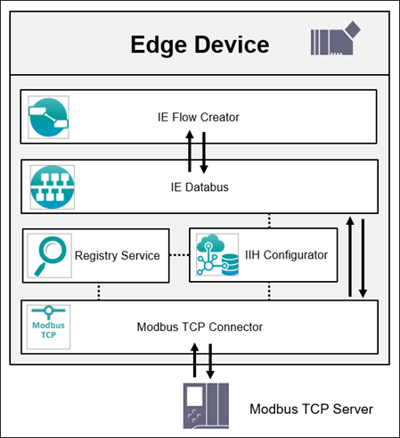

# Modbus TCP Connector application example

This example shows how to use the Industrial Edge App “Modbus TCP” 

- [Modbus TCP application example](#modbus-tcp-example)
  - [Description](#description)
    - [Overview](#overview)
    - [General task](#general-task)
  - [Requirements](#requirements)
    - [Prerequisities](#prerequisities)
    - [Used components](#used-components)
  - [Configuration steps](#configuration-steps)
  - [Usage](#usage)
  - [Documentation](#documentation)
  - [Contribution](#contribution)
  - [Licence and Legal Information](#licence-and-legal-information)

## Description

### Overview

In this example a connection between a Modbus server and clients is configured. The edge device acts as the client and the Modbus server can be any hardware that is able to instantiate standard Modbus communication. Please also check the documentation for the requirements.

### General task

Getting started Edge App Modbus TCP. 
In this example the Edge Device acts as Modbus client. 
For the ModBus Server any modbus TCP capable Device can be used (see Modbus TCP documentation system tested). 

## Requirements

###  Prerequisities

- Access to an Industrial Edge Management System (IEM)
- Onboarded Industial Edge Device on IEM
- Installed System Configurators for Databus 
- Installed System Apps Databus
- Installed Apps Modbus TCP Configurator, Modbus TCP Connector, IE-Flow Creator
- Edge device is connected to Modbus TCP Server
- Google Chrome (Version ≥ 72) or Firefox (Version ≥ 62)

### Used components

- Industrial Edge Management (IEM) V1.2.0-34
- IE Databus Configurator V1.2.29
- IE Databus V1.2.16
- Modbus TCP Connector V1.1.2
- Modbus TCP Configurator V1.1.2
- Modbus TCP Server (e.g. LOGO!230)
- Industrial Edge Device V 1.2.0-56
- Web browser (Mozilla or Chrome)

## Configuration steps

You can find the further information about the following steps in the [docs](docs/Installation.md)
- Download Modbus TCP Configurator & Connector on your Edge Device
- Activate ModBus TCP Server 
- Configure PLC Connection (Databus, Modbus TCP Configurator)
- Cofnigure Data Service and add ModBus Adapter 

## Documentation

You can find further documentation and help in the following links
  - [Industrial Edge Hub](https://iehub.eu1.edge.siemens.cloud/#/documentation)
  - [Industrial Edge Forum](https://www.siemens.com/industrial-edge-forum)
  - [Industrial Edge landing page](https://new.siemens.com/global/en/products/automation/topic-areas/industrial-edge/simatic-edge.html)
  
## Contribution

Thanks for your interest in contributing. Anybody is free to report bugs, unclear documenation, and other problems regarding this repository in the Issues section or, even better, is free to propose any changes to this repository using Merge Requests.

## Licence and Legal Information

Please read the [Legal information](LICENSE.md).
