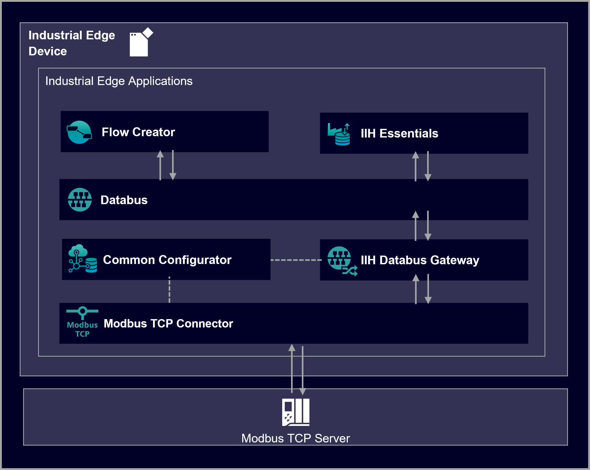

# Modbus TCP Connector

This example shows how to use the Industrial Edge app Modbus TCP Connector.

- [Modbus TCP Connector](#modbus-tcp-connector)
  - [Description](#description)
    - [Overview](#overview)
    - [General task](#general-task)
  - [Requirements](#requirements)
    - [Prerequisites](#prerequisites)
    - [Used components](#used-components)
  - [Configuration](#configuration)
  - [Usage](#usage)
  - [Documentation](#documentation)
  - [Contribution](#contribution)
  - [Licence and Legal Information](#licence-and-legal-information)

## Description

### Overview

This tutorial shows how to use the Industrial Edge application Modbus TCP Connector to establish a connection between an Industrial Edge Device (IED) and a PLC that supports Modbus TCP, a data communications protocol (client/server) that runs on Ethernet.

These PLC variants are supported:

- Schneider Quantum TCP/IP 140 CPU 113 03　
- Schneider TSX Premium TSXP573634　
- Schneider TSX Momentum 171CCC98020 (TCP/IP)　
- Schneider Micro TSX 3710001　
- Schneider M 340
- Schneider TM218LDAE24DRHN
- Schneider TM238LDD24DT
- Schneider TM258LD42DT　
- Siemens SIWAREX WP231　
- Siemens SIWAREX WP241

The Modbus TCP Connector is an application that runs on the individual IED. Connections can be configured using the IIH Configurator for Industrial Edge. The connector transfers the value series of selected data points from a PLC to the Databus. From there the data can be used within other Edge apps, e.g. the Flow Creator.

### General task

Here we configure a connection between a Modbus server and client. The IED acts as the Modbus client and the Modbus server can be any hardware that is able to instantiate standard Modbus communication. The data is published on the IE Databus. By using the application IE Flow Creator, we fetch the metadata of the Modbus TCP Connector, write some data on the configured tags and read out data.

## Requirements

###  Prerequisites

- Access to an Industrial Edge Management (IEM) with onboarded Industrial Edge Device (IED)
- IEM: Installed system configurator for Databus
- IED: Installed apps IE Databus, IE Flow Creator, IIH Configurator, IIH Registry Service, Modbus TCP Connector, Data Service (optional)
- IED is connected to Modbus TCP Server
- Google Chrome (Version ≥ 72)

### Used components

- Industrial Edge Management (IEM) V1.5.1-4 / V1.8.6
  - IE Databus Configurator V1.7.8
- Industrial Edge Device (OS) V1.8.0-6
  - IE Databus V1.7.1
  - IE Flow Creator V1.10.0-3
  - IIH Configurator V1.5.0
  - IIH Registry Service V1.5.0
  - Modbus TCP Connector V2.0.0-6
  - Data Service V1.5.0
- Modbus TCP Server

## Configuration

You can find further information about the following steps in the [Configuration](/docs/Installation.md) documentation:

- [Overview](/docs/Installation.md#overview)
- [Install Modbus TCP Connector](/docs/Installation.md#install-modbus-tcp-connector)
- [Configure IE Databus](/docs/Installation.md#configure-ie-databus)
- [Configure Modbus TCP via IIH Configurator](/docs/Installation.md#configure-modbus-tcp-via-iih-configurator)

## Usage

As soon as the Modbus TCP Connector is configured, data can be transfered.

You can find further information about how to handle the data via the IE Flow Creator in the [Usage](/docs/Usage.md) documentation:

* [Read metadata](/docs/Usage.md#read-metadata)
* [Write data](/docs/Usage.md#write-data)
* [Read data](/docs/Usage.md#read-data)
* [Use Data Service](/docs/Usage.md#use-data-service)

## Documentation

You can find further documentation and help in the following links

* [Industrial Edge Hub](https://iehub.eu1.edge.siemens.cloud/#/documentation)
* [Industrial Edge Forum](https://www.siemens.com/industrial-edge-forum)
* [Industrial Edge landing page](https://new.siemens.com/global/en/products/automation/topic-areas/industrial-edge/simatic-edge.html)
* [Industrial Edge GitHub page](https://github.com/industrial-edge)

## Contribution

Thank you for your interest in contributing. Anybody is free to report bugs, unclear documentation, and other problems regarding this repository in the Issues section.
Additionally everybody is free to propose any changes to this repository using Pull Requests.

If you are interested in contributing via Pull Request, please check the [Contribution License Agreement](Siemens_CLA_1.1.pdf) and forward a signed copy to [industrialedge.industry@siemens.com](mailto:industrialedge.industry@siemens.com?subject=CLA%20Agreement%20Industrial-Edge).

## Licence and Legal Information

Please read the [Legal information](LICENSE.md).
