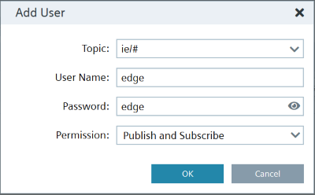
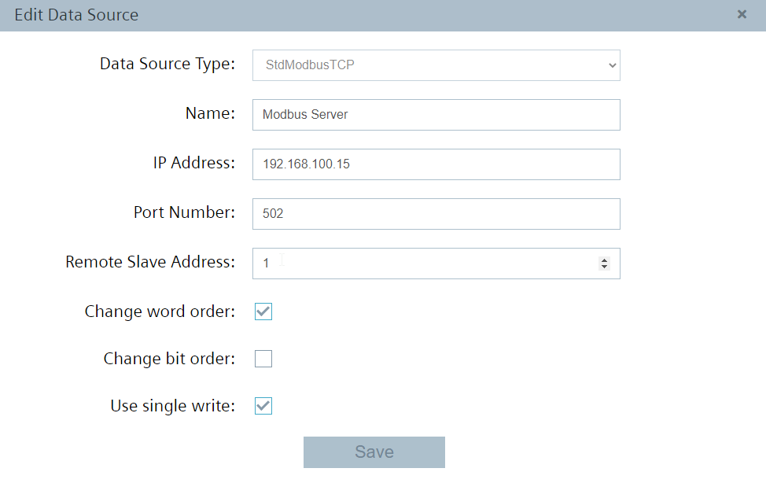
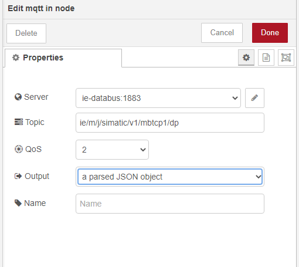

# Configuration

- [Configuration](#configuration)
  - [Configure Databus](#configure-databus)
  - [Configure Modbus TCP Configurator](#modbus-tcp-configurator)
  - [Configure IE-Flow Creator](#ie-flow-creator)
   

## Configure Databus

 Open the Databus and launch the configurator.

Add a user with the following topic:
`"ie/#"`

Deploy the configuration.

## Configure Modbus TCP Configurator

Open the app Modbus TCP Configurator.

On the left corner you can add the Data Source. 

![add_tag] Add multiple Tags(graphics/add_tag.png) 

![add_credentials]Adjust user credentials (graphics/add_credentials.png)

![workflow_project] Deploy and start the project(graphics/workflow_project.png)

![flow_creator] (graphics/flow_creator.png)

 Observe the incoming data via IE-Flow Creator "MQTT-In Node"
