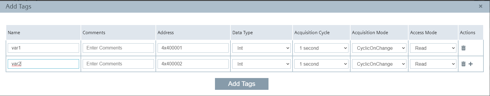
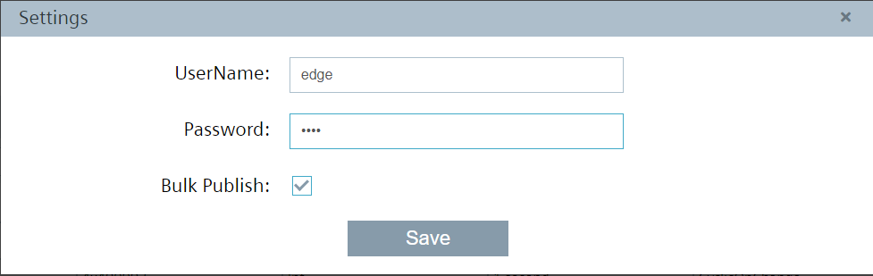
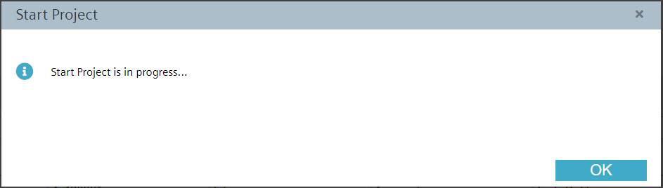
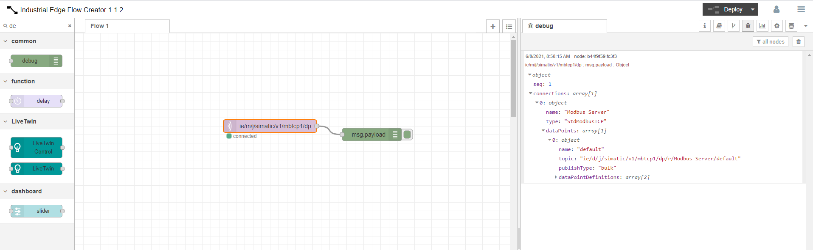

# Configuration

- [Configuration](#configuration)
  - [Configure Databus](#configure-databus)
  - [Configure Modbus TCP Configurator](#modbus-tcp-configurator)
  - [Configure IE-Flow Creator](#ie-flow-creator)
   

## Configure Databus

 Open the Databus and launch the configurator.

Add a user with the following topic:
`"ie/#"`

Deploy the configuration.

## Configure Modbus TCP Configurator

Open the app Modbus TCP Configurator.On the left corner you can add the Data Source. 

Add multiple Tags

 

Adjust user credentials 

Deploy and start the project

Open IE-Flow Creator 

Observe the incoming data via IE-Flow Creator "MQTT-In Node"

 
